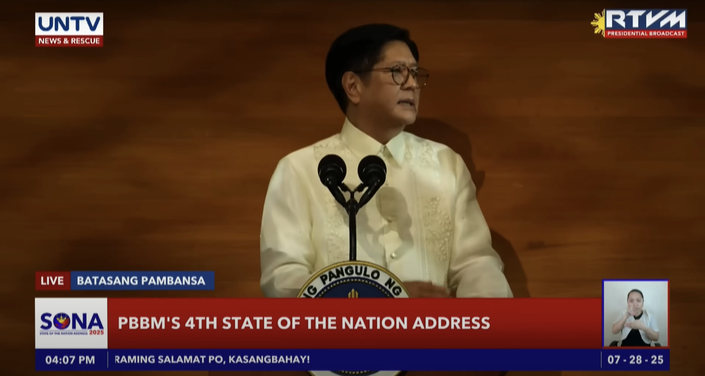

# Take on SONA July 2025 of Pres. Ferdinand R. Marcos Jr.
##  By Hannah Malaika B. Lopez 
##  9-Potassium

#### **What is STATE OF THE NATION ADDRESS (SONA)?**
##### **The STATE OF THE NATION ADDRESS(SONA)** is an annual political obligation in which the President of the Philippines (currently Pres. Fardinand Marcos Jr.) delivers a speech which talks about the present state of the country, as well as revealing the priorities and upcoming plans of the government.

#### **Pres. Ferdinand Marcos Jr.'s 4th SONA speech has many interesting points some of which are:**

* **Presidential Merit Scholarships:** Highschool students who achieve HIGHEST HONORS will receive scholarships from the government. This opens an opportunity for intelligent, but unfortunately financially unstable students to study whatever courses they desire. Further details are to be announced.

* **Promotion of the Net Metering Program:** The Net Metering Program is a program under Renewable Energy Act of 2008 or RA 9513 that lets people who have renewable energy systems (not exceeding 100kWp) distribute their unused energy to a distribution utility and in return, get peso credits which reduce their electric bill. The increased promotion of this program can encourage more people to switch to renewable energy which can help the environment. You can find more details in the [MERALCO](https://company.meralco.com.ph/advocacies/solar-net-metering/what-is-net-metering) and [Department of Energy (DOE)](https://doe.gov.ph) websites.

#### **Along with some interesting points, here is a point that struck me as quite peculiar:**

* **The Examining, Reporting and Publishing of Government projects:** This aims to give transparency for the people, so that they will know how their taxes are used. There is no problem with this, in fact it is a step in the right direction. The problem is why would it only be implemented now. This should be a bare minimum and not something that was overly rejoiced upon like how the government reacted. 

#### **Reflection**
###### All eyes were at Pres. Ferdinand Marcos Jr. at the 2025 SONA, as there were many people who doubt his ability as a leader. I must give where credits are due, the SONA 2025 was filled with many great projects, as well as great news on the state of some aspects of the Philippines. From the smaller-scale 20PHP per kilo rice being a success, to giving 2 million more Filipinos electricity, we can assumes that at least a few of PBBM's plans will become a success. I must admit I might've judged PBBM too hard when he ran for President in the 2022 elections, given his background. 

###### Though I praise PBBM for his achievements, there were some flaws in his SONA speech. I think the SONA speech was very general, which made it hard for me to make any specific comments or criticisms for his projects because there was not enough information given to judge, or make me and others fully convinced that all his projects will work. Another flaw was the fact that the finances were sort of glossed over. Though the cost of some projects were mentioned, a question that comes to the mind of many is "Where's the money coming from?". There are so many projects that PBBM mentioned, like planting 100 million coconut trees, giving 1 million SIM cards and free kidney transplants. This costs a huge amount of money and resources to consistently achieve this, and for a while now, many teachers have been advocating for a pay raise; so the fact that besides PBBM saying that he will reject plans that do not align with the National Expenditure program (which is a good idea), there is no further specific comments on finances. All in all, the SONA was decent, and I appreciate that PBBM pointed out the fact that the government is not that honest, even if some of his associates have a possibility of being corrupt.

## **Lastly, for the Philippines:**
#### In a country in which we cannot fully believe in our government: do not lose hope, with the success of some government projects, there is still a possibility that majority of the plans mentioned in the SONA can come true; also remember that we all have to do our part in the success of the country.

### | WATCH THE 2025 SONA HERE:
[SONA2025](https://youtu.be/YOoX7EVIOMA?si=saoadWzaKL7_TjXO)

###### Citations:
* DOEgovph.(2022, April 22).Guidelines on Net-Metering in the Philippines.[Video].https://www.youtube.com/watch?v=ohR13ILCBu4
* Inocencio, Syrah Vivien .(2025, July 28).Inside the SONA: What happens during a State of the Nation Address in the Philippines?.Tatler.https://www.tatlerasia.com/power-purpose/others/what-to-know-about-state-of-the-nation-address
* Meralco.(n.d.)What is Net-Metering?.https://company.meralco.com.ph/advocacies/solar-net-metering/what-is-net-metering
* Philippine Star.(2025, July, 28).PBBM FOURTH SONA SUMMARY.https://www.facebook.com/PhilippineSTAR/photos/pbbm-fourth-sona-summary-here-are-the-highlights-of-president-marcos-fourth-stat/1220051006825443
* Piquero, Pia.(2025, July 26).What is SONA, and why should you care about PBBM’s 4th address?.CDN Life!.https://cebudailynews.inquirer.net/648927/what-is-sona-and-why-should-you-care-about-pbbms-4th-address
* 
* Solaric.(n.d.)NET METERING: THE PROCESS AND WHY IT TAKES TIME.https://solaric.com.ph/blog/process-net-metering/#:~:text=All%20About%20Net%20Metering,to%20the%20customer%27s%20electric%20bill.”
